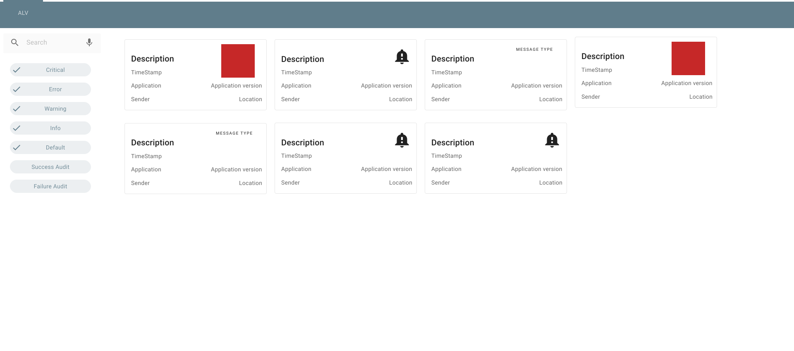

# place components using viewchilds

## Introduction

Let' us set the scene. A customer has a need for an angular 2+ website where the view depends on information coming for the backend. When we say view we mean view not just the data but also how it is presented to the user. There are multiple ways to accomplish this but most people will use either an if or switch statements. But what if we used the "viewchild" to dynamically change the component on render. This is what this blogpost will try to show.

## What we are going to create.

The image below gives you a design overview of what we will create.

 

A webpage containing 3 section by using the css grid system.

Section 1: a header showing us the name of the title

Section 2: a side bar menu, with a filter system and a search system

Section 3: The log messages

We made 3 different card designs.

1. Design 1: shows a big coloured square for the type
2. Design 2: Show an icon for the type
3. Design 3: Shows a text field for the type.

As you can see the pinnacle of good design. :\)

## Tools used

Design tool : Figma

Coding tool: Visual studio code

Extensions used in visual studio code: Angular snippets \(Version 9\), Angular Language Service, angular2-switcher, auto rename tag, Bracket pair colorizer 2, material icon theme, path intellisense, Prettier - code formatter, vscode-angular-html

Framework : Angular 9, angular material design, CSS grid

## Start of the application

For this article we are going to make a log viewer \(alv\) using Angular.

### setup angular project

We will begin by creating an empty angular 9 application.

Using your command line tool of choice let create the following application.

```bash
ng new alv --createApplication=false  --skipGit=true
```

This will create our empty project. Once this is generate go to the project folder.

```text
cd alv
```

Next lets generate the application that we are going to use for the base page and the default design.

```text
ng g application alv --prefix=allphi --routing=false --style=scss
```

As UI-toolkit we are going to use angular material designs.

So let's run the following command to setup angular material design.

```bash
ng add @angular/material
```

When prompted choose the theme, if you want global Typography and browser animations select yes for both.

We will also create a library project to hold two of the card-designs.

```bash
ng g library card-designs --prefix=cards
```

and one to hold our types.

```bash
ng g library alv-types --prefix=alv
```

**Note**: This is not required you can place everything within one project.

## The message interface

In our types library we will create the following interface. All message will implement this set of properties.

```typescript
export interface message {
    id:string;
    type: string;
    description: string;
    longDescription: string;
    timestamp: Date;
    location: string;
    sender: string;
    application: string;
    version: string;
}
```

## The cards

We will make 1 in the project and 2 in the library. This is not needed you could make all three in the same location. either the app or the library.

### Card 1

For the card in the app project we are going to creat a module.

```bash
ng g m cards
```

and then create the the component 

```bash
ng g c card/design1
```

No load the material card module in to the cards module:

```typescript
import {MatCardModule} from '@angular/material/card';
...
 imports: [
  CommonModule,
  MatCardModule
 ]
```

HTML:

```html
<mat-card class="example-card">
  <mat-card-title-group>
    <mat-card-title class="title">{{ message.description }}</mat-card-title>
    <mat-card-subtitle class="timestamp">{{ message.timestamp | date }}</mat-card-subtitle>
    <span class="state-box" [style.background]="getColor(message.type)"></span>
  </mat-card-title-group>

  <mat-card-content>
    <mat-card-subtitle>
      <div class="grid-container">
        <div class="app">{{ message.application }}</div>
        <div class="appv">{{ message.version }}</div>
        <div class="sender">{{ message.sender }}</div>
        <div class="location">{{ message.location }}</div>
      </div>
    </mat-card-subtitle>
  </mat-card-content>
</mat-card>
```

CSS:

```scss
.example-card {
  width: 344px;
  height: 172px;
  .title {
    position: absolute;
    height: 48px;
    left: 16px;
    right: 20px;
    top: 35px;
  }
  .timestamp {
    position: absolute;
    left: 16px;
    right: 120px;
    top: 72px;
    bottom: 79px;
  }
  .state-box {
    position: absolute;
    width: 81px;
    height: 81px;
    min-width: 81px;
    min-height: 81px;
    left: 234px;
    top: 12px;
    z-index: 3;
  }
}

.grid-container {
  position: absolute;
  width: calc(100% - 20px);
  left: 16px;
  top: 102px;
  display: grid;
  grid-template-rows: repeat(2, 1fr);
  grid-template-columns: repeat(2, 1fr);
  grid-template-areas:
    'app appv'
    'sender location';
  .app {
    grid-area: app;
  }
  .appv {
    grid-area: appv;
    text-align: end;
  }
  .sender {
    grid-area: sender;
  }
  .location {
    grid-area: location;
    text-align: end;
  }
}

table {
  tr {
    width: 100%;
    td {
      width: 50%;
    }
  }
}
```

Typescript:

```typescript
import { Component, OnInit, Input } from '@angular/core';
import { message } from 'projects/alv-types/src/public-api';

@Component({
  selector: 'allphi-design1',
  templateUrl: './design1.component.html',
  styleUrls: ['./design1.component.scss']
})
export class Design1Component implements OnInit {
  @Input() message: message;

  constructor() {}

  ngOnInit(): void {}

  getColor(type: string) {
    switch (type) {
      case 'Critical':
        return '#C62828';
      case 'Error':
        return '#EB5757';
      case 'Warning':
        return '#F2994A';
      case 'Info':
        return '#56CCF2';
      default:
        return '#000000';
    }
  }
}
```

